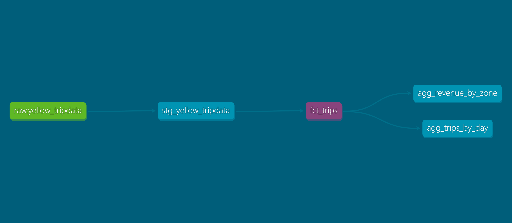

# NYC Taxi Data Engineering Pipeline

## Overview
An orchestrated, production-style data engineering pipeline that extracts NYC Yellow Taxi trip data monthly, loads it into Snowflake, and transforms it with dbt, all coordinated by Apache Airflow. Built to demonstrate real extract-load-transform (ELT) patterns: automated extraction, staged loading, incremental transformation, automated testing, and scheduled backfill.

## Architecture
```
NYC TLC (public parquet files)
        │
        ▼
   Airflow (Astro CLI, Docker)
        │  extract → stage → load
        ▼
   Snowflake (raw schema)
        │
        ▼
   dbt (via Cosmos, run as native Airflow tasks)
        │  staging → incremental fact table → aggregate marts
        ▼
   Snowflake (staging + marts schemas)
```


## Tech Stack
- **Orchestration**: Apache Airflow (via Astronomer's Astro CLI, running in Docker)
- **Transformation**: dbt Core + dbt-snowflake, integrated into Airflow via [Cosmos](https://github.com/astronomer/astronomer-cosmos)
- **Warehouse**: Snowflake
- **Source data**: [NYC TLC Trip Record Data](https://www.nyc.gov/site/tlc/about/tlc-trip-record-data.page) (public, monthly parquet files)

## Pipeline Stages

**1. Extract** — Airflow downloads the current month's Yellow Taxi trip data directly from NYC TLC's public CloudFront distribution. No manual downloads; the DAG computes which month to pull based on its own scheduled run date.

**2. Load** — The file is staged into a Snowflake internal stage and loaded into a raw table using `COPY INTO`. The raw table's schema is auto-generated from the actual parquet file using Snowflake's `INFER_SCHEMA`, rather than manually declaring 19 columns by hand.

**3. Transform (dbt, via Cosmos)**:
   - **Staging** (`stg_yellow_tripdata`): casts and cleans raw types — including fixing timestamps that Snowflake's schema inference read as raw microsecond integers rather than proper timestamps
   - **Marts** (`fct_trips`): an **incremental** model that filters out known data quality issues (negative fares, out-of-range dates) and appends only new data on each run, enabling safe monthly backfill without duplication
   - **Aggregates**: `agg_trips_by_day` and `agg_revenue_by_zone`, the latter joining a dbt seed (`taxi_zone_lookup`) to convert location IDs into readable zone names

**4. Test** — 5 dbt tests run automatically after each build: not-null checks, accepted-value checks, and a custom test flagging negative fares (set to warn, not error, since it documents a known, intentionally-handled condition rather than a pipeline bug).

**5. Schedule** — Runs monthly (`@monthly`), with `catchup=True` enabling automatic backfill of historical months.

## Real Problems Solved

This project surfaced (and required fixing) several genuine data engineering issues, not just a happy-path pipeline:

- **Schema inference mismatch**: raw parquet timestamps came through as microsecond-epoch integers, not timestamps. Fixed in the staging layer with `TO_TIMESTAMP_NTZ(..., 6)`.
- **Data quality**: ~1.2% of trips have negative fare amounts (refunds/corrections), and a small number of trips have corrupted pickup dates (e.g., timestamps decades off). Both are filtered in the marts layer, not staging, keeping raw data untouched as a source of truth.
- **Incremental correctness**: an early version of `fct_trips` was a full-rebuild table, which would have silently discarded prior months on every backfill run. Rebuilt as a proper incremental model with a timestamp watermark.
- **Snowflake role/ownership gotchas**: objects created by one role aren't automatically visible to others, including admin roles, without explicit or future grants. Hit this twice (once debugging, once mid-backfill) and fixed it with `GRANT ... ON FUTURE TABLES`.
- **Duplicate load bug**: manual re-triggering during development doubled the raw table's row count. Diagnosed via row-count sanity checks and fixed by deduplicating and rebuilding.
- **Graceful failure on unpublished data**: NYC TLC publishes with a ~2 month lag. The pipeline explicitly catches this (HTTP error on download) and fails with a clear, actionable message rather than crashing ambiguously or loading bad data.
- **Cosmos/Airflow version specifics**: resolved a Cosmos API mismatch (enum vs. string for execution mode) and Python import-ordering issues.
- **ARM architecture compatibility**: validated that Airflow (via Astro/Docker) and the full pipeline run correctly on Windows ARM64, without requiring x86 emulation workarounds.

## What I'd Do Next
- Add a `dbt_utils`-style surrogate key or real trip ID for more robust deduplication than full-row matching
- Move Snowflake credentials to a secrets backend (e.g., Airflow's Secrets Manager integration) instead of a connection stored in the metadata database
- Add Slack/email alerting on task failure
- Extend to green taxi and FHV (Uber/Lyft) trip data for cross-service comparison
